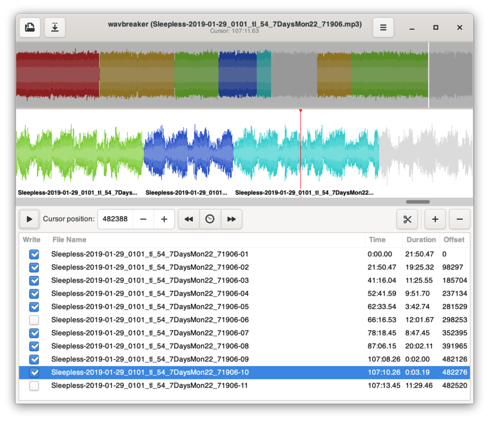

wavbreaker
==========

This application's purpose in life is to take a WAV file and break it up
into multiple WAV files. It makes a clean break at the correct position
to burn the files to an Audio CD without any dead air between the tracks.

wavbreaker now also directly supports breaking up MP3s without re-encoding
meaning it's fast and there is no generational loss. Decoding (using mpg123)
is only done for playback and waveform display.

The GUI displays a waveform summary of the entire file at the top. The middle
portion displays a zoomed-in view that allows you to select where to start
playing and where it will make the break. The bottom portion contains a list
of track breaks. You may change file names and uncheck parts that you do not
want to have written out to disk when saving.

There is also a command line tool `wavmerge` to merge WAV files together.
If you download a show and don't like how it was tracked, you can merge them
together with `wavmerge` and then break them back up with wavbreaker. The
wavmerge tool will only work on files that have the same format (for example,
44.100 Hz sample rate, 16-bit sample size, etc.).

Screenshot
----------

How to Build
------------

wavbreaker now uses the [Meson Build system](https://mesonbuild.com/). To
build wavbreaker in the `build` directory, run:

    meson build
    ninja -C build

macOS Packaging
---------------

    scripts/build.sh macos

Note that the macOS package doesn't include the runtime dependencies by
default, those are expected to be installed via Homebrew:

    brew install gtk+3 libao mpg123

Windows Packaging
-----------------

    scripts/build.sh windows
